# MaaYYs 使用指南

本指南旨在指导你怎么用MaaYYs。

## 注意事项

开始前，有几件事你得知道：

1.  **本软件暂时以模拟器为主**。
2.  **雷电模拟器适配最佳**，mumu也可以使用，但是可能存在我没有发现的bug，欢迎加群反馈。
3.  **主要以官服为主**，如果你是渠道服，可以到群里找我，我会添加支持。

## 快速开始

### 1. 下载

首先，你要搞清楚 **MFWPH** 和 **MaaYYs** 的区别：

- **MFWPH** 是单独的程序。
- **MaaYYs** 是带了所有资源的完整包。

所以，如果你只是需要一个能直接用的阴阳师自动化工具，就去 [MaaYYs Releases](https://github.com/TanyaShue/MaaYYs/releases) 下载那个 **完整包**。

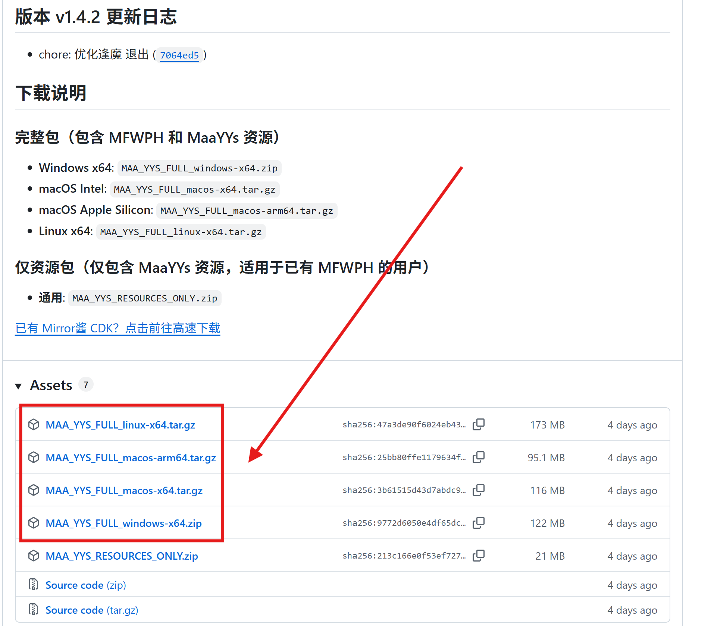

### 2. 运行

1.  下载好对应你系统版本的压缩包后，随便解压到一个目录里。
2.  运行里面的 `MFWPH.exe`（这里拿windows举例）。
3.  稍等片刻，你应该就能看到如下的软件界面。

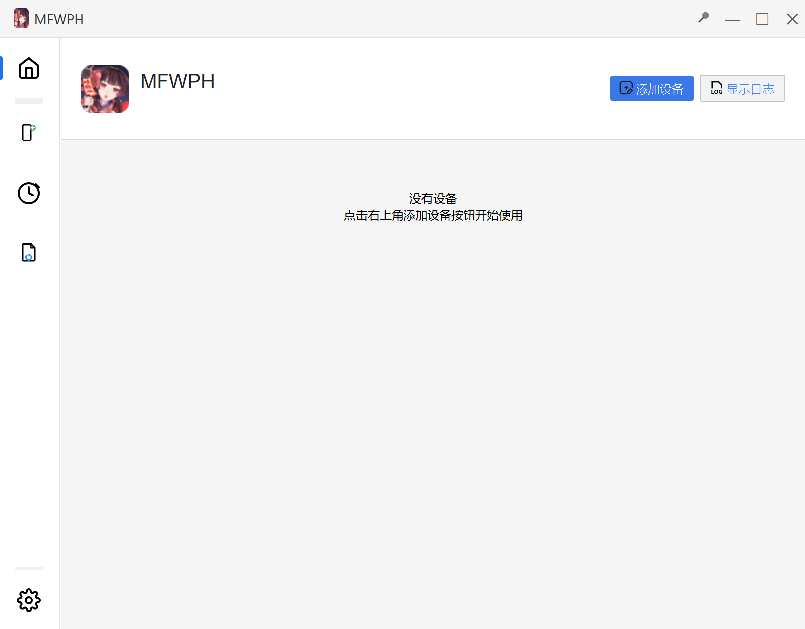

### 3. 添加设备（模拟器）

1.  接着打开你的模拟器，**确保模拟器处于运行状态**，再进行下一步。
2.  点击首页右上角的 **“添加设备”**。
3.  在弹窗中，软件会自动搜索设备，找到你的模拟器后，选中并保存。

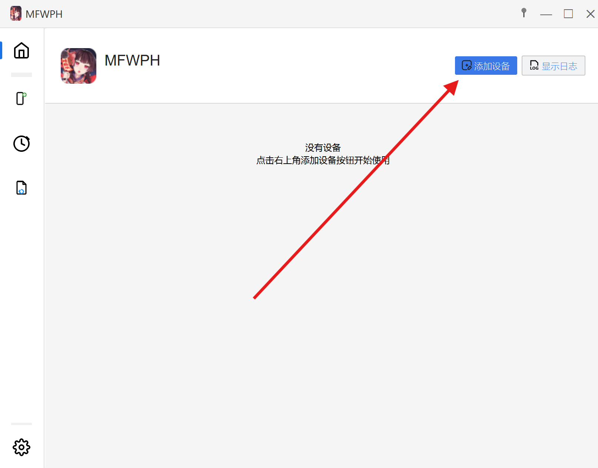
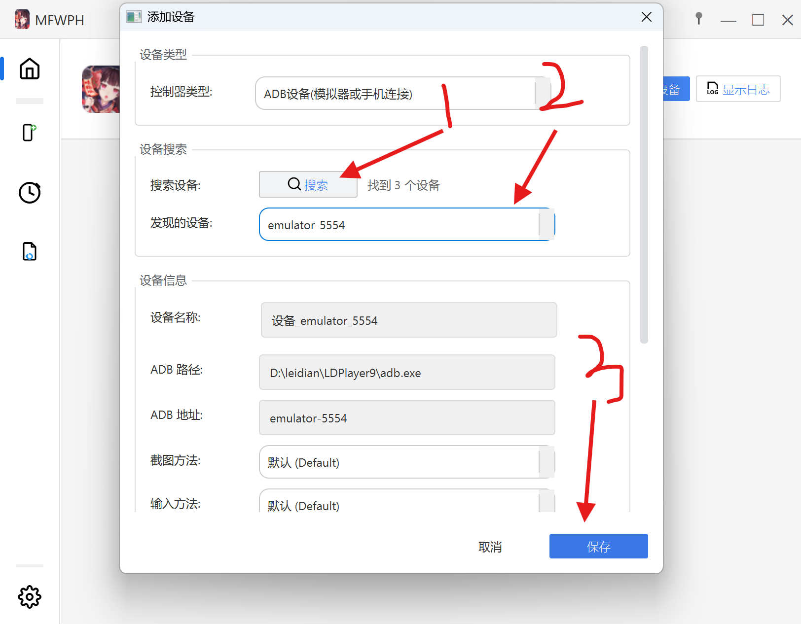

> **提示**：如果这里没找到你的模拟器，别慌，可以手动添加。手动添加的教程在文章最后，也可以点 **[这里](#-手动添加设备)** 跳转。

### 4. 设置任务

添加成功后，你应该就能在主页看到设备卡片了。首次启动前，需要进行一些设置。

1.  点击设备详情。

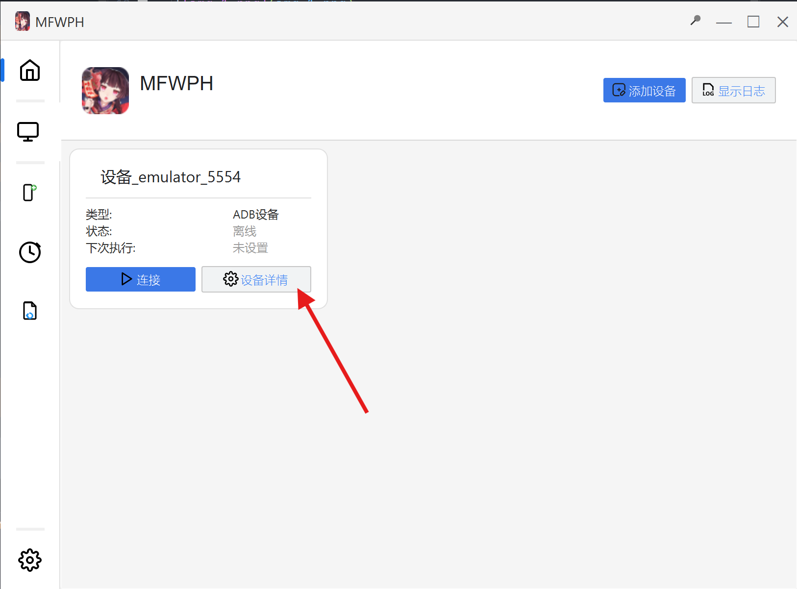

2.  在新界面里，确保下图箭头1指向的复选框是勾选状态，并且箭头3指向的位置显示 **“已启用”**。如果显示“已禁用”，就重新勾选一下那个框。

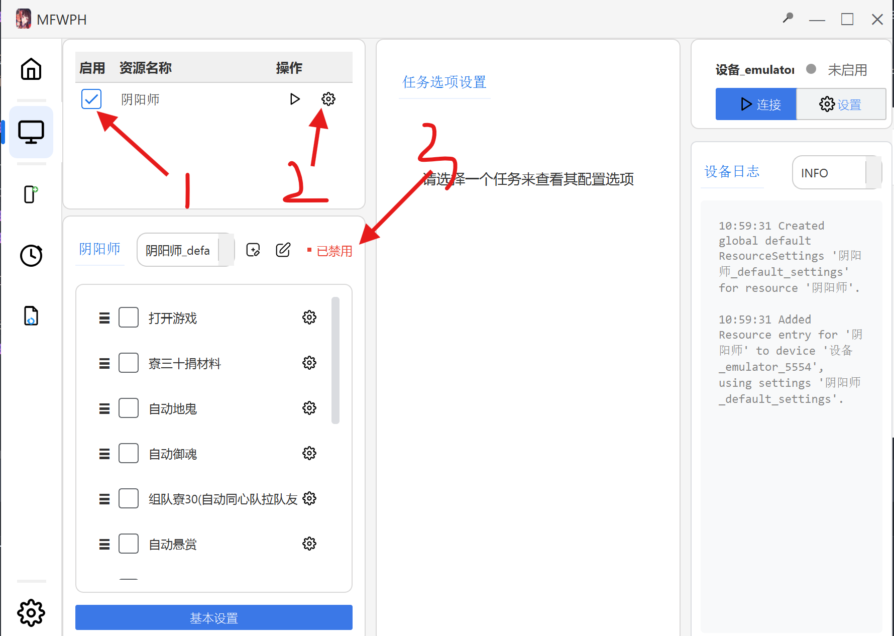

3.  接着就可以开始设置你要启动的任务了，依次设置就行。

### 5. 启动任务！

当所有需要设置的任务都设置好之后，就可以点击右上角的 **“连接”** 或 **“启动”** 来启动任务了。

- **首次启动**：需要下载依赖，这期间不要关闭或暂停软件。这需要等待一段时间，但通常不会超过10分钟。如果超过10分钟，大概率就有问题了。
- **运行中**：当按钮变成 **“暂停”**，则表示软件正在运行，通常就没什么问题了。

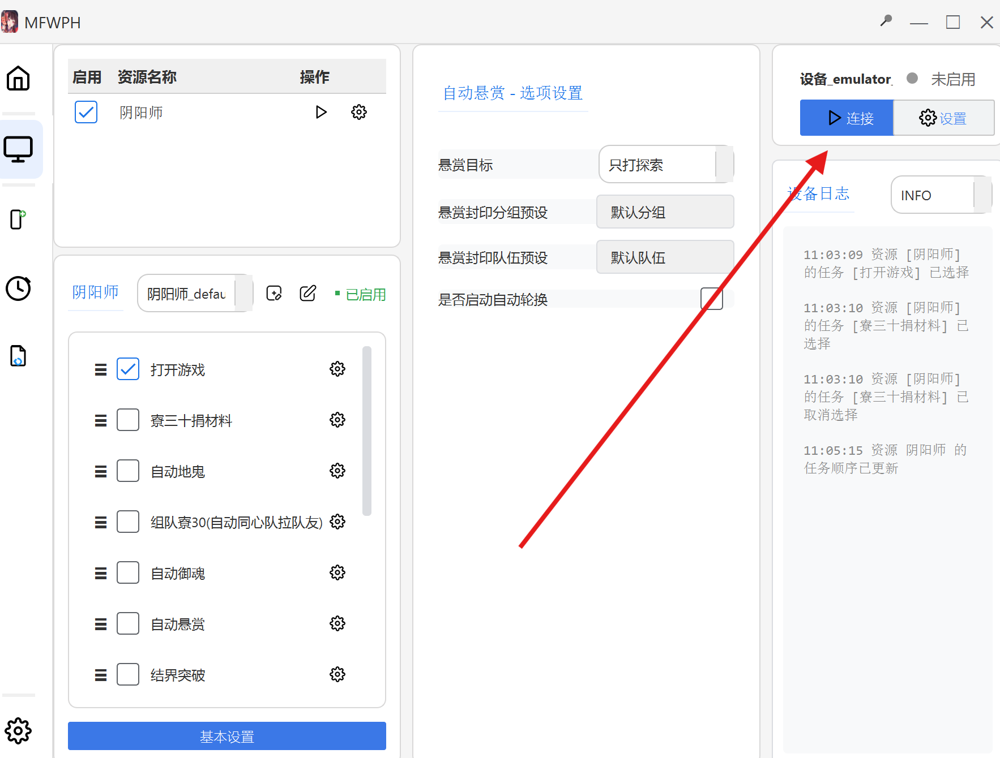

> **注意**：软件在自动化运行的过程中可能出现卡在某个节点的情况（比如庭院），这可能是因为很多庭院皮肤我都没有，所以没法做到完整适配。这时你可能需要到群里反馈，我会尽可能支持。

## ⚙️ 一些任务的设置注意事项

这里举例几个比较典型的任务，说说要注意的“坑”。

#### 1. 启动任务

启动任务这里有很多不同的区服，虽然都是官服，但是他们真实的包名是不同的，所以启动任务可能失败。我尽量都列了出来，但是还是可能存在没有的（比如渠道服），这些你们可以到群里反馈，我看到会添加进来。

#### 2. 悬赏任务或其它需要填队伍预设的任务

这里需要 **特别注意**！这些分组和队伍预设名称需要 **尽量少使用或者不使用符号和空格**（因为OCR模型可能无法正确识别）。

如果遇见任务卡在这个界面，很可能就是识别队伍时出现异常。看看是不是队伍名称或者分组名称带了符号或者空格，可以删除后再试一次，还是不行可以到群里反馈。

像我图片中这样就没什么问题。当然，这个分组你可以按照你自己的喜好来写。

## 手动添加设备

如果自动搜索死活找不到你的模拟器，那就得自己动手了。

### 1. 确定模拟器的 ADB 端口

这一步不同的模拟器都不相同。

- **MuMu 模拟器**：在模拟器设置里，确保 **“ADB调试”** 是开着的。然后去“设备诊断”里看具体的网络端口。如果像下图这样有两个端口，随便填一个就行（比如 `5555` 或者 `16384`）。
  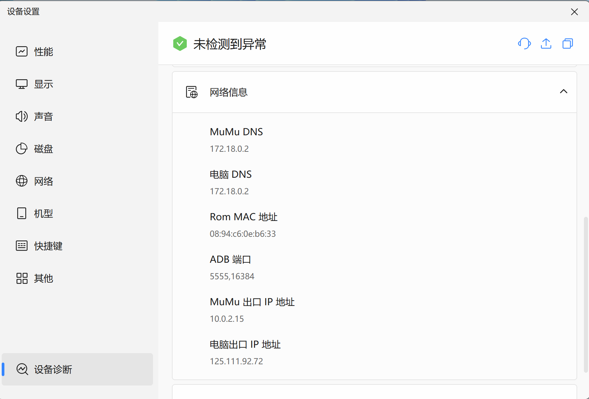

- **雷电模拟器**：也是先在设置里打开 **“ADB调试”**。雷电的端口比较有规律，通常第一个是 `5555`，后面每多开一个就加2（比如第二个是 `5557`）。但要找到准确的端口，请看下一步。

### 2. 找到 adb.exe 并获取设备名/端口

1.  各个模拟器的 `adb.exe` 路径都不同，但大致都在模拟器的安装目录下。你可以在桌面右键模拟器图标，选择 **“打开文件所在目录”**。
2.  看看里面是否存在一个名为 `adb.exe` 的程序。如果存在，就复制当前这个文件夹的路径。

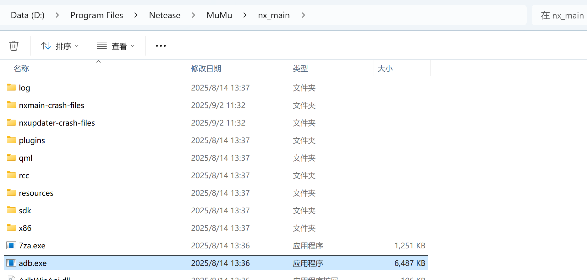

3.  **对于雷电模拟器**：
    - 在 `adb.exe` 所在的文件夹地址栏输入 `cmd` 然后回车。
    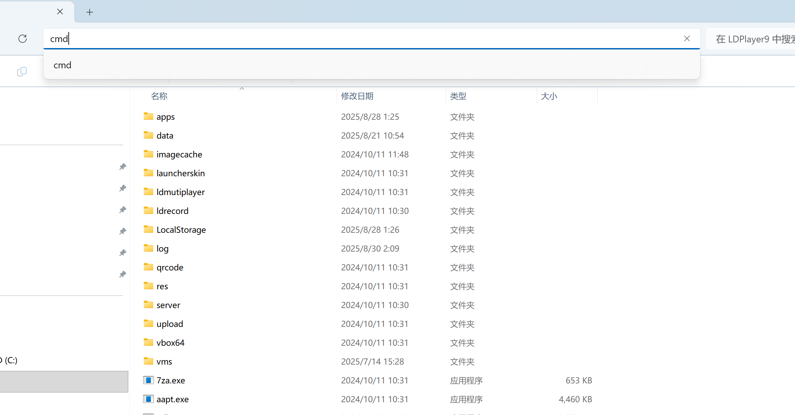
    - 在打开的黑窗口里输入 `adb.exe devices` 然后回车，就能看到端口了。
    - 这里有两种情况：
        - 直接显示端口，如 `127.0.0.1:5555`。
        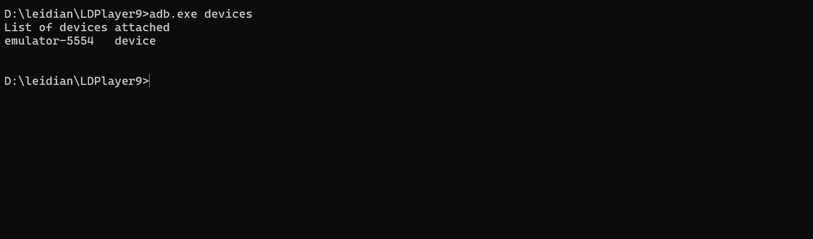
        - 显示设备名称，如 `emulator-5554`。这时直接复制这个设备名称就行。
        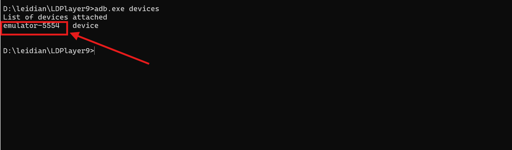

### 3. 填写设备信息

回到软件的添加设备窗口，把找到的信息填进去：

- **ADB 路径**：就是上面让你复制的 `adb.exe` 的完整路径，比如 `D:\Program Files\Netease\MuMu\nx_main\adb.exe`。
- **ADB 地址**：
    - 如果你找到的是 `127.0.0.1:端口` 这种，就直接填。
    - 如果是雷电模拟器显示的 `emulator-5554` 这种设备名，就直接把这个名字填进去。
    - **雷电小技巧**：`emulator-5554` 这个设备名，它的端口其实就是 `5555`（设备号加一）。所以你填 `127.0.0.1:5555` 也行。

填写完成大概长这样：

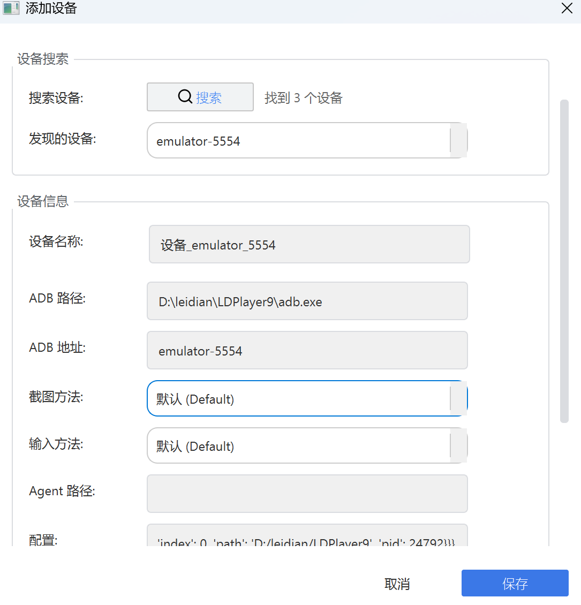

这就是手动添加设备的全过程，我这里只是举例了雷电和mumu，其它模拟器同理。